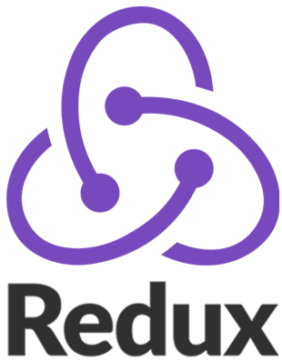

---

&nbsp;&nbsp;&nbsp;&nbsp;I am Yura Ogonovski, Frontend Web Developer. My main area of professional activity is the React library. I like to spend most of my time coding projects and learning something new. However I also like to chat so I'm open to conversations. Can't wait to get my first job in which I will develop and grow to a strong technical specialist.

-   🌍  I'm based in **Belarus**, **Minsk**
-   🖥️  See my portfolio at **[My portfolio](http://github.com/Kaelns/protfolio)**
-   🧠  I'm currently learning **Redux Query**

### 🎓 Skills

  &nbsp;
  &nbsp;
  &nbsp;
  &nbsp;
  &nbsp;
  &nbsp;
  &nbsp;
  &nbsp;
  &nbsp;
  &nbsp;
  &nbsp;
  &nbsp;
  &nbsp;
  &nbsp;
  &nbsp;
  

### ✉️  Reach me out

  
  
  
  

### ⭐ Badges

-   **🗂️ Pet Project**

&nbsp;&nbsp;&nbsp;&nbsp;&nbsp;&nbsp;

-   **⚡ Tasks**

